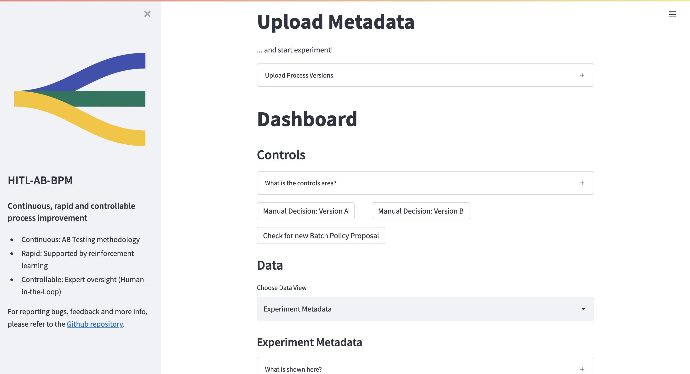

# HITL AB-BPM Prototype

> Continuous, rapid and controllable business process improvement

## Structure
This repository contains the three main parts of the prototype: The backend, the frontend and the camunda engine.

For more info on the parts of the app, please refer to the READMEs in the sub-folders (`source/backend`, `source/frontend`, `api-tests`...).
We try to incorporate the READMEs at the spots where they are most relevant, in order to not add too much information here.

Instructions on how to run the app locally can be found in `source/README.md`.

## Contributing

Whenever you encounter a :beetle: **bug** or have :tada: **feature request**, 
report this via Github issues.

### Git Commit Messages

Commits should start with a Capital letter and should be written in present tense (e.g. __:tada: Add cool new feature__ instead of __:tada: Added cool new feature__).
You should also start your commit message with **one** applicable emoji. This does not only look great but also makes you rethink what to add to a commit. Make many but small commits!

| Emoji                                                     | Description                                             |
|-----------------------------------------------------------|---------------------------------------------------------|
| :tada: `:tada:`                                           | When you added a cool new feature.                      |
| :wrench: `:wrench:`                                       | When you refactored / improved some code / added tests. |
| :sparkles: `:sparkles:`                                   | When you improved style.                                |
| :art: `:art:`                                             | When you improved / added assets like themes.           |
| :rocket: `:rocket:`                                       | When you improved performance.                          |
| :memo: `:memo:`                                           | When you wrote documentation.                           |
| :beetle: `:beetle:`                                       | When you fixed a bug.                                   |
| :twisted_rightwards_arrows: `:twisted_rightwards_arrows:` | When you merged a branch.                               |
| :fire: `:fire:`                                           | When you removed something.                             |
| :truck: `:truck:`                                         | When you moved / renamed something.                     |